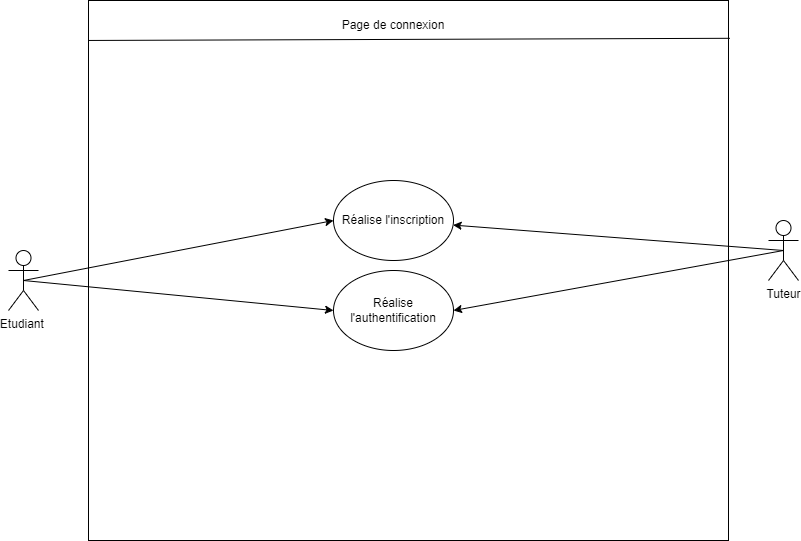

## Besoin

En tant qu'étudiant/tuteur je dois pouvoir m'authentifier afin d'accéder à l'ensemble du contenue de l'application.

## Fonctionnalité

- Lorsque l'étudiant/tuteur se connecte, il est redirigé vers la page tableau de bord.
- Lorsque l'étudiant/tuteur se déconnecte, il est redirigé vers la page de connexion.

---

## Besoin

En tant qu'étudiant/tuteur, je dois pouvoir m'inscrire afin d'accéder à l'ensemble du contenue de l'application.

## Fonctionnalité

- Lorsque l'étudiant/tuteur s'inscris sur l'application après avoir remplis les champs et validé, il est redirigé vers la page tableau de bord.

---

# Besoin

En tant qu'étudant/tuteur, je dois pouvoir récupérer mon mot de passe afin d'accéder à l'ensemble du contenue de l'application.

# Fonctionnalité

- Lorsque l'étudiant/tuteur inscris son adresse mail sur le formulaire, il reçoit un email contenant un lien permettant de récupérer son mot de passe.

---

