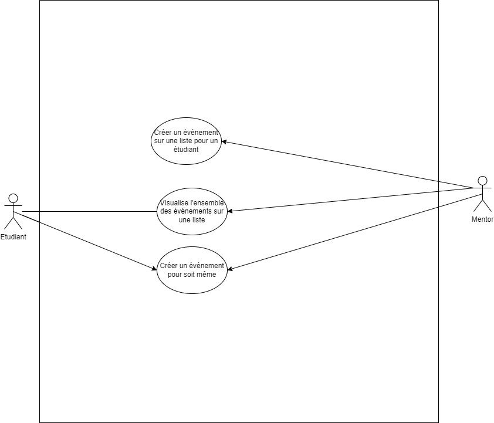

# Besoin

**En tant qu'** étudiant/tuteur, **je dois pouvoir** visualiser la liste d'événements, **afin d'** avoir une dicussion instannée avec un intermédiaire.

# Fonctionnalité

Scenario : L'étudiant/tuteur, accède à la page contenent le calendrier.

**Etant donné** que l'acteur est déjà authentifier par le système d'authentification, **lorsque** l'acteur accède à la page contenent le calendrier, **alors** l'acteur est capable de visualiser :

- Le calendrier
- Les événements prochains qui lui sont attribués

---

# Besoin

En tant que tuteur, je dois pouvoir créer un évènement et l'affecter à un étiudiant.

# Fonctionnalité

**Etant donné** que l'acteur est déjà authentifier par le système d'authentification, **lorsque** l'acteur clique sur le bouton "créer un évènement", il est capable de créer un évènement et l'affecter à un étiudiant.

