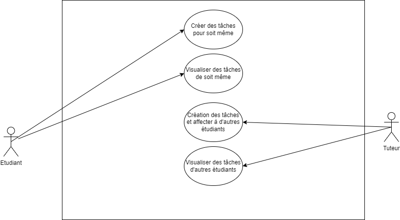

# Besoin

**En tant que** tuteur, **je dois pouvoir** créer et visualiser les tâches que j'affecte à un étudiant, **afin que** l'étudiant et tuteur puisse voir les objectifs.

# Fonctionnalité

- Permettre au tuteur de créer une tâche et de l'affecter à un étudiant.
- Permettre au tuteur de visualiser l'ensemble des tâches de ces étudiants.

---

