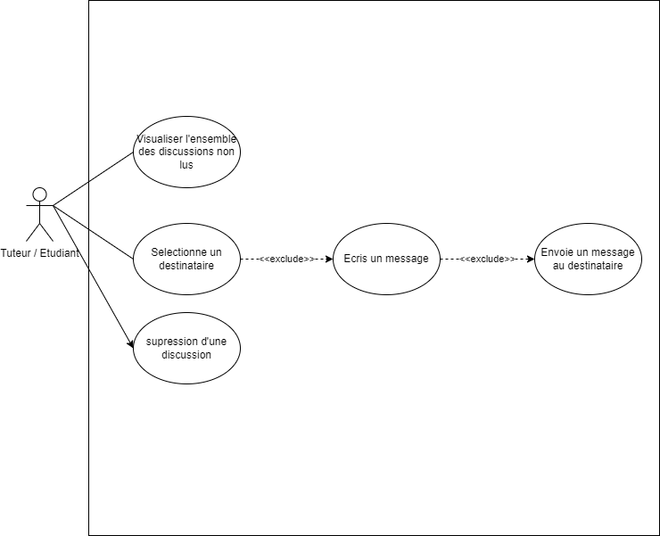

# Besoin

En tant qu'étudiant/tuteur, je dois pouvoir échanger via une messagerie instatanée entre acteurs, afin d'éavoir une dicussion instatannée avec d'autres acteurs (étudiant/tuteur).

# Fonctionnalité

- La photo de profil de l'expéditeur, à côté de chaque message
- Un indicateur permettant de visualiser si un message a été lu ou non
- L'horodatage des messages

