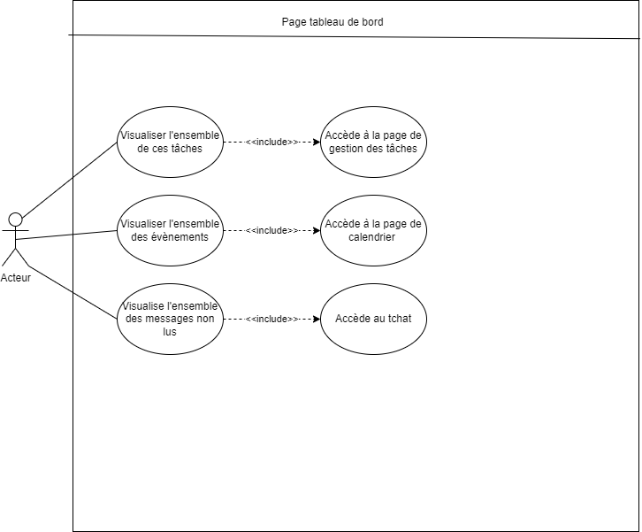

# Besoin

En tant qu'étudiant/tuteur je dois pouvoir accéder à la to-do liste présente dans la page tableau de bord afin de visualiser les événements prochains, le calendrier et le compteur de message.

# Fonctionnalité

- Permettre à l'étudiant/tuteur de visualiser la todo-list, les événements prochains, le calenderier et le compteur de message non lus..

